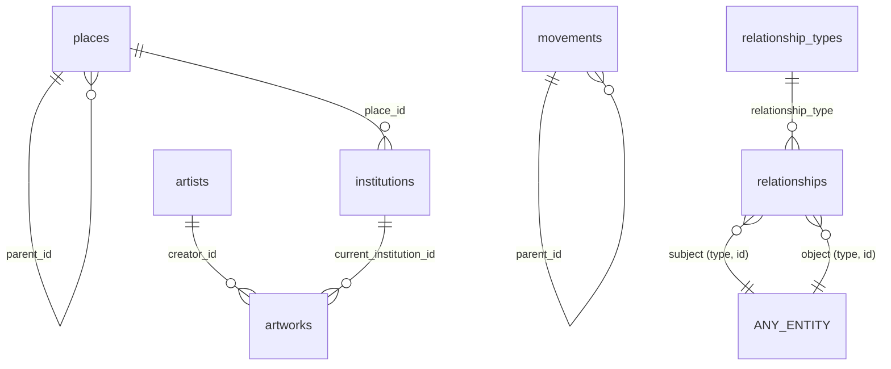

# Data model

PostgreSQL 18 + PostGIS 3.6. Schema lives in [`db/migrations/`](../db/migrations/) — never edit an applied
migration; add a new numbered file instead.

`ANY_ENTITY` = artists · artworks · institutions · patrons · movements · places.

## Entity tables
One table per entity type, each with its own columns. Shared conventions:

| Column | Purpose |
|---|---|
| `id bigint identity` | internal key, used in relationships |
| `slug` (unique, `kebab-case`) | stable public key: URLs, import upserts (`ON CONFLICT (slug)`) |
| `wikidata_id` (unique, `Q…`) | optional, for de-duplication and later enrichment |
| `metadata jsonb` | free-form extras (sources, dimensions …) — must be an object |
| `*_md` | Markdown; rendered with markdown-it and **sanitized** server-side before reaching the frontend |
| `created_at` / `updated_at` | `updated_at` maintained by trigger |

## Fuzzy dates → `daterange`
Historical dates are rarely exact, so every date is a **half-open range** plus a display label:

| Meaning | Stored value | Label |
|---|---|---|
| 30 March 1853 | `[1853-03-30, 1853-03-31)` | `30 March 1853` |
| 1760 | `year_range(1760)` → `[1760-01-01, 1761-01-01)` | `1760` |
| c. 1480 | `year_range(1478, 1482)` | `c. 1480` |
| 500 BCE | `year_range(-500)` | `500 BCE` |

This makes timeline queries plain range operators, backed by GiST indexes:
`lifespan @> date '1850-01-01'` (alive then), `period && year_range(1860, 1890)` (overlaps).
`artists.lifespan` is a stored generated column (earliest birth → latest death).

## Places & geography
`places.location geography(Point, 4326)` (map marker) and optional `area geography(MultiPolygon, 4326)` for regions,
both GiST-indexed. `geography` measures in metres on the sphere: `ST_DWithin(a.location, b.location, 150000)` = within 150 km.
The API returns GeoJSON (`ST_AsGeoJSON`) — nothing tile-specific; basemap tiles come from MapTiler.
Places form a hierarchy via `parent_id` (Arles ⊂ Provence ⊂ France).

## Relationships
One generic edge table: `(subject_type, subject_id) —relationship_type→ (object_type, object_id)`,
with optional `period`, `period_label`, `label`, `certainty` (attested/probable/possible/disputed), `notes_md`.

**All** entity-to-place links (born in, lived in, created in, inspired by …) are relationships, not columns —
an artist can have any number of them, each with its own dates.

### Vocabulary (`relationship_types`, seeded in migration 002)
Each type declares which entity types it may connect, its inverse label, and two flags:

- `is_physical_presence` — the subject was physically there (`born_in`, `died_in`, `lived_in`, `worked_in`,
  `visited`, `created_in`). **Only these may be drawn as travel routes.** Non-physical links
  (`inspired_by_place`, `influenced_by_culture_of`, `active_in`) go on a visually distinct layer — e.g. Van Gogh's
  Japonisme traces to Japan without implying he travelled there.
- `is_symmetric` — `contemporary_of`, `collaborated_with` are stored once in canonical order (A↔B = B↔A).

Query the current list: `SELECT code, label, subject_types, object_types FROM relationship_types ORDER BY sort_order;`

### Integrity (what foreign keys can't do here)
Postgres FKs can't point at "a row in one of six tables", so triggers enforce it:

- `relationships_validate` (before insert/update): type allows this subject/object entity type; both ids exist;
  symmetric edges normalised.
- `<table>_delete_relationships` (after delete on each entity table): removes that entity's edges in both directions.
- Unique `NULLS NOT DISTINCT (subject, type, object, period)` — no exact duplicates; repeats with different periods are fine.
- Plain FKs (`creator_id`, `current_institution_id`, `place_id`, `parent_id`) are `ON DELETE RESTRICT`:
  curated data is never removed implicitly.

### Querying both directions
- "Who influenced X": `WHERE subject_type='artist' AND subject_id=X AND relationship_type='influenced_by'` (unique index)
- "Whom did X influence": `WHERE object_type='artist' AND object_id=X AND relationship_type='influenced_by'` (`relationships_object_idx`)
- Chains: `WITH RECURSIVE … CYCLE object_type, object_id SET is_cycle USING path` — see `db/tests/schema_smoke.sql`.

## Roles & privileges
| Role | Used by | Can |
|---|---|---|
| `arthistory_owner` | `npm run migrate` only | DDL, owns everything |
| `arthistory_admin` | admin panel pool | SELECT/INSERT/UPDATE/DELETE on content; no DDL, no TRUNCATE, 30 s timeout |
| `arthistory_api` | public API pool | SELECT only; `default_transaction_read_only`, 5 s timeout |

New tables get these grants automatically (`ALTER DEFAULT PRIVILEGES` in `db/setup-database.sql`).
`schema_migrations` is readable by the owner only.

## Databases
- `arthistory` — production (pm2 `arthistory-api`, `npm run migrate`)
- `arthistory_dev` — development (`npm run dev` on port 3005, `npm run migrate:dev`)

Smoke test (runs as admin, rolls back): `psql -h localhost -U arthistory_admin -d arthistory_dev -f db/tests/schema_smoke.sql`
