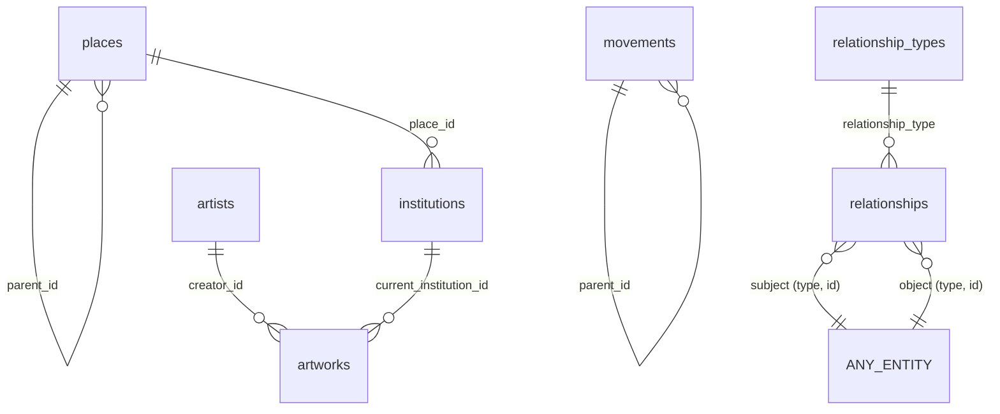

# Data model

PostgreSQL 18 + PostGIS 3.6. Schema lives in [`db/migrations/`](../db/migrations/) — never edit an applied
migration; add a new numbered file instead.


```mermaid
erDiagram
    places ||--o{ places : "parent_id"
    places ||--o{ institutions : "place_id"
    artists ||--o{ artworks : "creator_id"
    institutions ||--o{ artworks : "current_institution_id"
    movements ||--o{ movements : "parent_id"
    relationship_types ||--o{ relationships : "relationship_type"
    relationships }o--|| ANY_ENTITY : "subject (type, id)"
    relationships }o--|| ANY_ENTITY : "object (type, id)"
```

`ANY_ENTITY` = artists · artworks · institutions · people (patrons before 024) · movements · places · polities.

## Entity tables
One table per entity type, each with its own columns. Shared conventions:

| Column | Purpose |
|---|---|
| `id bigint identity` | internal key, used in relationships |
| `slug` (unique, `kebab-case`) | stable public key: URLs, import upserts (`ON CONFLICT (slug)`) |
| `wikidata_id` (unique, `Q…`) | optional, for de-duplication and later enrichment |
| `metadata jsonb` | free-form extras (sources, dimensions …) — must be an object |
| `*_md` | Markdown; rendered with markdown-it and **sanitized** server-side before reaching the frontend |
| `created_at` / `updated_at` | `updated_at` maintained by trigger |

## Fuzzy dates → `daterange`
Historical dates are rarely exact, so every date is a **half-open range** plus a display label:

| Meaning | Stored value | Label |
|---|---|---|
| 30 March 1853 | `[1853-03-30, 1853-03-31)` | `30 March 1853` |
| 1760 | `year_range(1760)` → `[1760-01-01, 1761-01-01)` | `1760` |
| c. 1480 | `year_range(1478, 1482)` | `c. 1480` |
| 500 BCE | `year_range(-500)` | `500 BCE` |
| since 1808 (ongoing) | `[1808-01-01,)` — infinite upper bound | `since 1808` |

Open ends are for periods only (relationships, `movements.period`, `people.active`), never for births, deaths,
creation or founding dates. An ongoing period overlaps every later window, which is what "still there" means.

This makes timeline queries plain range operators, backed by GiST indexes:
`lifespan @> date '1850-01-01'` (alive then), `period && year_range(1860, 1890)` (overlaps).
`artists.lifespan` is a stored generated column (earliest birth → latest death).

## Places & geography
`places.location geography(Point, 4326)` (map marker) and optional `area geography(MultiPolygon, 4326)` for regions,
both GiST-indexed. `geography` measures in metres on the sphere: `ST_DWithin(a.location, b.location, 150000)` = within 150 km.
The API returns GeoJSON (`ST_AsGeoJSON`) — nothing tile-specific; basemap tiles come from MapTiler.
Places form a hierarchy via `parent_id` (Arles ⊂ Provence ⊂ France).

## Relationships
One generic edge table: `(subject_type, subject_id) —relationship_type→ (object_type, object_id)`,
with optional `period`, `period_label`, `label`, `certainty` (attested/probable/possible/disputed), `notes_md`.

**All** entity-to-place links (born in, lived in, created in, inspired by …) are relationships, not columns —
an artist can have any number of them, each with its own dates.

### Vocabulary (`relationship_types`, seeded in migration 002)
Each type declares which entity types it may connect, its inverse label, and two flags:

- `is_physical_presence` — the subject was physically there (`born_in`, `died_in`, `lived_in`, `worked_in`,
  `visited`, `created_in`, `located_in`). **Only these may be drawn as travel routes.** Non-physical links
  (`influenced_by_culture_of`, `depicts`, `active_in`) go on a visually distinct layer — e.g. Van Gogh's
  Japonisme traces to Japan without implying he travelled there.
- `is_symmetric` — `contemporary_of`, `collaborated_with` are stored once in canonical order (A↔B = B↔A).
- Migration 007: `inspired_by_place` removed (overlapped with `influenced_by_culture_of`); `depicts` (artwork → place:
  the place is the subject) added; `owned_by`, `commissioned` and `patron_of` also accept institutions (church, guild,
  museum) and places (a city or state as a public body). A state is a polity (migration 019).
- Every relationship is stored in one direction (subject → object). The admin form also offers the reverse types
  ("commissioned by" on an artwork's page) and swaps them into canonical order on save.

Query the current list: `SELECT code, label, subject_types, object_types FROM relationship_types ORDER BY sort_order;`

### Integrity (what foreign keys can't do here)
Postgres FKs can't point at "a row in one of six tables", so triggers enforce it:

- `relationships_validate` (before insert/update): type allows this subject/object entity type; both ids exist;
  symmetric edges normalised.
- `<table>_delete_relationships` (after delete on each entity table): removes that entity's edges in both directions.
- Unique `NULLS NOT DISTINCT (subject, type, object, period)` — no exact duplicates; repeats with different periods are fine.
- Current vs. history: `artworks.current_institution_id` / `institutions.place_id` hold where something is **now**;
  earlier holdings/locations are dated `housed_at` / `located_in` relationships (migration 005), needed only when it moved.
- Plain FKs (`creator_id`, `current_institution_id`, `place_id`, `parent_id`) are `ON DELETE RESTRICT`:
  curated data is never removed implicitly.

### Querying both directions
- "Who influenced X": `WHERE subject_type='artist' AND subject_id=X AND relationship_type='influenced_by'` (unique index)
- "Whom did X influence": `WHERE object_type='artist' AND object_id=X AND relationship_type='influenced_by'` (`relationships_object_idx`)
- Chains: `WITH RECURSIVE … CYCLE object_type, object_id SET is_cycle USING path` — see `db/tests/schema_smoke.sql`.

## Read-API helpers (migration 004)
- `f_unaccent(text)` — IMMUTABLE wrapper around `unaccent()` so it can be indexed; trigram GIN indexes on
  `f_unaccent(name)` of every entity table serve `ILIKE '%…%'` and `<%` (word similarity) → accent-insensitive fuzzy search.
- `range_json(daterange, label)` → `{label, from, to (inclusive), from_year, to_year}` — the API's date shape.
- `entity_index` view — `UNION ALL` of all six tables as `(type, id, slug, name, period, period_label, kind)`;
  filters on `type`/`id` are pushed down into each branch, so lookups still use primary keys.

## Admin working copies (migrations 010, 011)
`admin_drafts` holds per-user drafts of *new* entries. `live_docs` holds one shared working copy per existing entry
being edited: a Yjs document (`state bytea`, the CRDT's binary encoding), the entry version it is based on, whether it
differs from the published row, and who changed it. Neither is content: not audited, invisible to the API role.
Publishing goes through the normal save path (validation, optimistic locking, audit log).

## Artwork dimensions and materials (migration 015)
`height_cm`, `width_cm`, `depth_cm` are `numeric(8,2)` (exact decimals) with one rule (migration 020): each value only
together with the ones before it — height alone (a sculpture), height × width, or all three. `materials text[]` complements the free-text `medium`; its GIN index serves containment queries
(`materials @> ARRAY['bronze']`, the API's `?material=`). In YAML and forms: `dimensions: [h, w]` / `[h, w, d]`.

### Constraints added NOT VALID (migration 016)
`artworks_inventory_needs_institution` was added `NOT VALID`: Postgres enforces it for new and changed rows but has
not checked the existing ones (one violated it). The quality view lists remaining violations; when none is left,
`ALTER TABLE … VALIDATE CONSTRAINT` checks all rows once without blocking writes, and the constraint is fully valid.

## Images (migration 017)
Artworks, artists and institutions can have several images (front, back, detail, installation view …) in one table
`images (url, source_url, license, credit, caption, position)`. It belongs to exactly one entry through an
**exclusive arc**: three nullable foreign keys `artwork_id`, `artist_id`, `institution_id` and
`CHECK (num_nonnulls(artwork_id, artist_id, institution_id) = 1)`. Unlike the generic `relationships` table (any entity
type, checked by triggers), real foreign keys work here — and `ON DELETE CASCADE` takes an entry's images with it.
Per arc a partial index `(…_id, position)` serves "the images of this entry, in order", and a partial **unique** index
`(…_id, url)` keeps the same image from being added twice (the YAML import upserts by it:
`ON CONFLICT (artwork_id, url) WHERE artwork_id IS NOT NULL` — the predicate selects the partial index).
`ORDER BY position, id`; the first image is the main one (list thumbnail, preview, the API's `image_url`). The API
builds the list with `jsonb_agg(jsonb_build_object(…) ORDER BY position, id)`. The former single-image columns
(014 and earlier) were moved here as position 0 and dropped.

## Polities and countries (migrations 018, 019)
"Which country is it in today?" and "which polity did it belong to?" are kept apart:
- **Today** is derived, never entered: `place_country(place_id)` walks up `parent_id` with a recursive CTE that stops at
  the first place with a `country_code`; `entity_home_place()` picks the place that counts (birthplace, place of
  creation, an institution's location); `entity_country()` combines them, with the linked polities' `country_codes` as
  fallback when they name exactly one country (`HAVING count(DISTINCT code) = 1`).
- **Polities** (`polities`: states, empires, kingdoms, dynasties) are an entity type with a `period` (when they existed)
  and `country_codes text[]` (ISO codes of the modern countries on their territory; one `CHECK` validates the whole
  array through `array_to_string(…) ~ regex`; GIN index for `@>`). Links are ordinary dated relationships:
  `nationality` (artist/person), `created_in_polity` (artwork), `located_in_polity` (institution) — category
  `polity`, not physical presence, so never drawn as travel. The quality check `outside_polity_period` reports links
  whose period cannot overlap the polity's (`NOT (r.period && p.period)`).
- Adding the type needed two migrations: `ALTER TYPE … ADD VALUE` (018) can't be used in the transaction that adds it.
  `entity_table(type)` maps a type to its table (`polity` → `polities`, not type + "s").

## Names and languages (migration 022)
Each entity table has `<name>_lang` (BCP 47, `CHECK lang_tag_ok()`), `<name>_ruby` (the name with furigana markup
`{base|reading}`; the name column itself stays plain, kept in step by `CHECK ruby_plain(<name>_ruby) = <name>`) and
`names jsonb` — other names `[{text, lang, role}]`, validated by `CHECK names_valid(names)` (a SQL function over
`jsonb_array_elements`). A jsonb column rather than a child table because names belong to the entry: saved,
versioned, reverted, co-edited and exported with it. `names_text()` flattens them (with readings) for search; an
expression GIN index `f_unaccent(names_text(names)) gin_trgm_ops` serves trigram matching. `name_sort_key()` picks the
first romanization for sorting; `entity_index` exposes `names` and `sort_key`. Functions called from index
expressions are schema-qualified inside each other: since Postgres 17, index builds run with a restricted search_path.

Migration 023: `kana_romaji()` (PL/pgSQL, IMMUTABLE) turns kana into Hepburn — katakana → hiragana with `translate()`,
two-character syllables before single ones (`FOREACH … SLICE 1` over a constant array of pairs), っ doubling the next
consonant with `regexp_replace`. `name_alt_text(ruby, names)` = everything besides the name an entry is found by
(other names, readings, romaji long and short); the `<table>_alt_trgm` indexes are on exactly that expression, which
the queries repeat so the planner can use them. `name_sort_key(name, ruby, names)`: the name when it has Latin
letters, else its romanization, else the romaji of its reading.

## People (migration 024)
Patrons became `people`: everyone relevant who isn't an artist (poets, rulers, monks, sitters) and groups (`kind`:
family, dynasty, religious order, guild). Rule: whoever made art is an artist. "Patron" is a role — the patronage
relationships. `ALTER TYPE entity_type RENAME VALUE 'patron' TO 'person'` renamed the type everywhere at once (enum
columns store the label's internal number); text copies were updated by hand (function bodies, the delete trigger's
argument, `audit_log` JSON, quality acknowledgements). New: `birth`/`death` + generated `lifespan` (as artists),
`occupations text[]` (GIN), `notes_md` → `description_md`; relationship `depicts_person` (artwork → person/artist,
category `depiction`, in the graph); people may also be `influenced_by`, `collaborated_with`, `associated_with`, and
teachers (`student_of`).

## Auto-created entries (migration 021)
A creator or institution typed into an artwork form as a new name is created with the save (same transaction, so a
revert removes both); entries the Wikidata comparison creates too. Each gets a row in `auto_created` (type, id, the
entry being saved, who, when) until it is next published or marked complete; the quality view lists them
(`auto_created`, warning), the admin list shows "to complete". The generic delete trigger
`delete_entity_relationships()` also removes the row — one `CREATE OR REPLACE FUNCTION` covers every entity table.

## Data quality (migration 013)
`quality_issues` is a view with one `SELECT` per check (`UNION ALL`): `check_id, severity, entity_type, entity_id,
issue_key, detail`. The date checks are range operators — `&&` overlap, `<<` entirely before, `>>` entirely after,
`*` intersection — so fuzzy dates only count as a contradiction when they cannot overlap at all. Place outlines use
PostGIS `ST_Covers(parent.area, child.location)`; duplicates `similarity()` from pg_trgm. Findings confirmed as correct
go into `quality_acks (check_id, issue_key)` and are filtered out with a `LEFT JOIN … WHERE a.check_id IS NULL`.

## Roles & privileges
| Role | Used by | Can |
|---|---|---|
| `arthistory_owner` | `npm run migrate` only | DDL, owns everything |
| `arthistory_admin` | admin panel pool, import | SELECT/INSERT/UPDATE/DELETE on content; no DDL, no TRUNCATE, 30 s timeout |
| `arthistory_api` | public API pool, export | SELECT only; `default_transaction_read_only`, 5 s timeout |

New tables get these grants automatically (`ALTER DEFAULT PRIVILEGES` in `db/setup-database.sql`).
`schema_migrations` is readable by the owner only. Migration 006 tightens the admin tables:

| Table | api | admin |
|---|---|---|
| `admin_users` | — | SELECT, UPDATE of `last_login_at`, `password_hash` only (column privileges); users are created as owner |
| `admin_sessions` | — | read/write |
| `audit_log` | — | SELECT only — rows arrive via the trigger, never directly |

## Audit log (migration 006)
`AFTER INSERT OR UPDATE OR DELETE … FOR EACH ROW` on the six entity tables and `relationships` calls `audit_row()`,
which stores the whole row before/after as JSONB (`to_jsonb(OLD)`, `to_jsonb(NEW)`), skipping updates that changed
nothing but `updated_at`. Who and from where come from transaction-local settings the writer sets —
`set_config('arthistory.user_id', '1', true)`, `set_config('arthistory.source', 'admin', true)` — so a pooled
connection can't leak them into the next request; untagged changes (psql by hand) are recorded as `sql`.
`audit_row()` is `SECURITY DEFINER` (runs as the owner): the admin role can add history only by changing data,
never write, edit or delete history itself. `txid` (`pg_current_xact_id()`) groups the rows of one save.

Migration 009 adds `reverts` (txid of the change set a revert undid) and `restores` (audit entry an entity was restored
to), set through `arthistory.reverts` / `arthistory.restores` like the other settings. The admin panel re-creates
deleted rows from `old_row` with `INSERT … OVERRIDING SYSTEM VALUE SELECT … FROM jsonb_populate_record(NULL::<table>, old_row)`
— the same id, every column type converted back by Postgres.

```sql
-- What changed in the last save, key by key:
SELECT k, old_row->k AS before, new_row->k AS after
FROM audit_log, jsonb_object_keys(new_row) k
WHERE id = (SELECT max(id) FROM audit_log) AND old_row->k IS DISTINCT FROM new_row->k;
```

## Databases
- `arthistory` — production (pm2 `arthistory-api`, `npm run migrate`)
- `arthistory_dev` — development (`npm run dev` on port 3005, `npm run migrate:dev`)

Smoke test (runs as admin, rolls back): `psql -h localhost -U arthistory_admin -d arthistory_dev -f db/tests/schema_smoke.sql`
