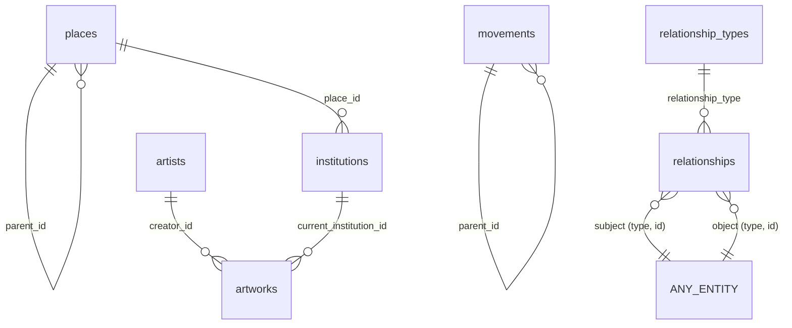

# Data model

PostgreSQL 18 + PostGIS 3.6. Schema lives in [`db/migrations/`](../db/migrations/) — never edit an applied
migration; add a new numbered file instead.


```mermaid
erDiagram
    places ||--o{ places : "parent_id"
    places ||--o{ institutions : "place_id"
    artists ||--o{ artworks : "creator_id"
    institutions ||--o{ artworks : "current_institution_id"
    movements ||--o{ movements : "parent_id"
    relationship_types ||--o{ relationships : "relationship_type"
    relationships }o--|| ANY_ENTITY : "subject (type, id)"
    relationships }o--|| ANY_ENTITY : "object (type, id)"
```

`ANY_ENTITY` = artists · artworks · institutions · patrons · movements · places.

## Entity tables
One table per entity type, each with its own columns. Shared conventions:

| Column | Purpose |
|---|---|
| `id bigint identity` | internal key, used in relationships |
| `slug` (unique, `kebab-case`) | stable public key: URLs, import upserts (`ON CONFLICT (slug)`) |
| `wikidata_id` (unique, `Q…`) | optional, for de-duplication and later enrichment |
| `metadata jsonb` | free-form extras (sources, dimensions …) — must be an object |
| `*_md` | Markdown; rendered with markdown-it and **sanitized** server-side before reaching the frontend |
| `created_at` / `updated_at` | `updated_at` maintained by trigger |

## Fuzzy dates → `daterange`
Historical dates are rarely exact, so every date is a **half-open range** plus a display label:

| Meaning | Stored value | Label |
|---|---|---|
| 30 March 1853 | `[1853-03-30, 1853-03-31)` | `30 March 1853` |
| 1760 | `year_range(1760)` → `[1760-01-01, 1761-01-01)` | `1760` |
| c. 1480 | `year_range(1478, 1482)` | `c. 1480` |
| 500 BCE | `year_range(-500)` | `500 BCE` |
| since 1808 (ongoing) | `[1808-01-01,)` — infinite upper bound | `since 1808` |

Open ends are for periods only (relationships, `movements.period`, `patrons.active`), never for births, deaths,
creation or founding dates. An ongoing period overlaps every later window, which is what "still there" means.

This makes timeline queries plain range operators, backed by GiST indexes:
`lifespan @> date '1850-01-01'` (alive then), `period && year_range(1860, 1890)` (overlaps).
`artists.lifespan` is a stored generated column (earliest birth → latest death).

## Places & geography
`places.location geography(Point, 4326)` (map marker) and optional `area geography(MultiPolygon, 4326)` for regions,
both GiST-indexed. `geography` measures in metres on the sphere: `ST_DWithin(a.location, b.location, 150000)` = within 150 km.
The API returns GeoJSON (`ST_AsGeoJSON`) — nothing tile-specific; basemap tiles come from MapTiler.
Places form a hierarchy via `parent_id` (Arles ⊂ Provence ⊂ France).

## Relationships
One generic edge table: `(subject_type, subject_id) —relationship_type→ (object_type, object_id)`,
with optional `period`, `period_label`, `label`, `certainty` (attested/probable/possible/disputed), `notes_md`.

**All** entity-to-place links (born in, lived in, created in, inspired by …) are relationships, not columns —
an artist can have any number of them, each with its own dates.

### Vocabulary (`relationship_types`, seeded in migration 002)
Each type declares which entity types it may connect, its inverse label, and two flags:

- `is_physical_presence` — the subject was physically there (`born_in`, `died_in`, `lived_in`, `worked_in`,
  `visited`, `created_in`, `located_in`). **Only these may be drawn as travel routes.** Non-physical links
  (`influenced_by_culture_of`, `depicts`, `active_in`) go on a visually distinct layer — e.g. Van Gogh's
  Japonisme traces to Japan without implying he travelled there.
- `is_symmetric` — `contemporary_of`, `collaborated_with` are stored once in canonical order (A↔B = B↔A).
- Migration 007: `inspired_by_place` removed (overlapped with `influenced_by_culture_of`); `depicts` (artwork → place:
  the place is the subject) added; `owned_by`, `commissioned` and `patron_of` also accept institutions (church, guild,
  museum) and places (a city or state as a public body). A historical polity is better a patron of kind `state`.
- Every relationship is stored in one direction (subject → object). The admin form also offers the reverse types
  ("commissioned by" on an artwork's page) and swaps them into canonical order on save.

Query the current list: `SELECT code, label, subject_types, object_types FROM relationship_types ORDER BY sort_order;`

### Integrity (what foreign keys can't do here)
Postgres FKs can't point at "a row in one of six tables", so triggers enforce it:

- `relationships_validate` (before insert/update): type allows this subject/object entity type; both ids exist;
  symmetric edges normalised.
- `<table>_delete_relationships` (after delete on each entity table): removes that entity's edges in both directions.
- Unique `NULLS NOT DISTINCT (subject, type, object, period)` — no exact duplicates; repeats with different periods are fine.
- Current vs. history: `artworks.current_institution_id` / `institutions.place_id` hold where something is **now**;
  earlier holdings/locations are dated `housed_at` / `located_in` relationships (migration 005), needed only when it moved.
- Plain FKs (`creator_id`, `current_institution_id`, `place_id`, `parent_id`) are `ON DELETE RESTRICT`:
  curated data is never removed implicitly.

### Querying both directions
- "Who influenced X": `WHERE subject_type='artist' AND subject_id=X AND relationship_type='influenced_by'` (unique index)
- "Whom did X influence": `WHERE object_type='artist' AND object_id=X AND relationship_type='influenced_by'` (`relationships_object_idx`)
- Chains: `WITH RECURSIVE … CYCLE object_type, object_id SET is_cycle USING path` — see `db/tests/schema_smoke.sql`.

## Read-API helpers (migration 004)
- `f_unaccent(text)` — IMMUTABLE wrapper around `unaccent()` so it can be indexed; trigram GIN indexes on
  `f_unaccent(name)` of every entity table serve `ILIKE '%…%'` and `<%` (word similarity) → accent-insensitive fuzzy search.
- `range_json(daterange, label)` → `{label, from, to (inclusive), from_year, to_year}` — the API's date shape.
- `entity_index` view — `UNION ALL` of all six tables as `(type, id, slug, name, period, period_label, kind)`;
  filters on `type`/`id` are pushed down into each branch, so lookups still use primary keys.

## Roles & privileges
| Role | Used by | Can |
|---|---|---|
| `arthistory_owner` | `npm run migrate` only | DDL, owns everything |
| `arthistory_admin` | admin panel pool, import | SELECT/INSERT/UPDATE/DELETE on content; no DDL, no TRUNCATE, 30 s timeout |
| `arthistory_api` | public API pool, export | SELECT only; `default_transaction_read_only`, 5 s timeout |

New tables get these grants automatically (`ALTER DEFAULT PRIVILEGES` in `db/setup-database.sql`).
`schema_migrations` is readable by the owner only. Migration 006 tightens the admin tables:

| Table | api | admin |
|---|---|---|
| `admin_users` | — | SELECT, UPDATE of `last_login_at`, `password_hash` only (column privileges); users are created as owner |
| `admin_sessions` | — | read/write |
| `audit_log` | — | SELECT only — rows arrive via the trigger, never directly |

## Audit log (migration 006)
`AFTER INSERT OR UPDATE OR DELETE … FOR EACH ROW` on the six entity tables and `relationships` calls `audit_row()`,
which stores the whole row before/after as JSONB (`to_jsonb(OLD)`, `to_jsonb(NEW)`), skipping updates that changed
nothing but `updated_at`. Who and from where come from transaction-local settings the writer sets —
`set_config('arthistory.user_id', '1', true)`, `set_config('arthistory.source', 'admin', true)` — so a pooled
connection can't leak them into the next request; untagged changes (psql by hand) are recorded as `sql`.
`audit_row()` is `SECURITY DEFINER` (runs as the owner): the admin role can add history only by changing data,
never write, edit or delete history itself. `txid` (`pg_current_xact_id()`) groups the rows of one save.

```sql
-- What changed in the last save, key by key:
SELECT k, old_row->k AS before, new_row->k AS after
FROM audit_log, jsonb_object_keys(new_row) k
WHERE id = (SELECT max(id) FROM audit_log) AND old_row->k IS DISTINCT FROM new_row->k;
```

## Databases
- `arthistory` — production (pm2 `arthistory-api`, `npm run migrate`)
- `arthistory_dev` — development (`npm run dev` on port 3005, `npm run migrate:dev`)

Smoke test (runs as admin, rolls back): `psql -h localhost -U arthistory_admin -d arthistory_dev -f db/tests/schema_smoke.sql`
